# Enterprise Data Agent

**Ask business questions in plain language and get governed, explainable answers directly from enterprise databases.**

Enterprise Data Agent is a read-only conversational analytics platform. It combines semantic knowledge, certified metrics, human-reviewed learning, safe SQL planning, live database execution, grounding, and lineage in one workflow.

It is not simply an LLM that writes SQL. The platform knows which database the user selected, limits the model to authorized context, applies approved company meaning, validates every query, and shows why the answer can be trusted.

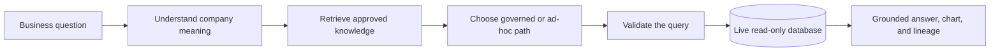

## Why This Project Exists

A basic text-to-SQL chatbot follows a short path:

> Question → LLM → SQL → database

That is useful, but enterprise analytics adds harder problems. Company metrics have specific definitions. Legacy databases use internal names and status codes. Entity names can be ambiguous. Fiscal calendars differ. SQL can be valid and still answer the wrong question. Users also need to know where a number came from.

| Basic text-to-SQL | Enterprise Data Agent |
| --- | --- |
| LLM guesses database meaning | Human-confirmed semantic knowledge |
| Metrics are recreated per question | Certified, reusable business metrics |
| Little or no governance | AI proposes; a human approves, edits, or rejects |
| SQL goes directly to the database | Authorization, SQLGlot validation, and read-only execution |
| Dates may be interpreted by the model | Deterministic datasource time policies |
| One database context | Isolated knowledge and execution per datasource |
| Weak explanation | Grounding, lineage, and **Why This Answer?** |
| One-off testing | Saved evaluations and regression tracking |

## Architecture At A Glance

The web interface and API expose one consistent analytics experience. Behind it, the router chooses between governed metrics and safe ad-hoc analysis; both paths converge on the same grounded result contract.

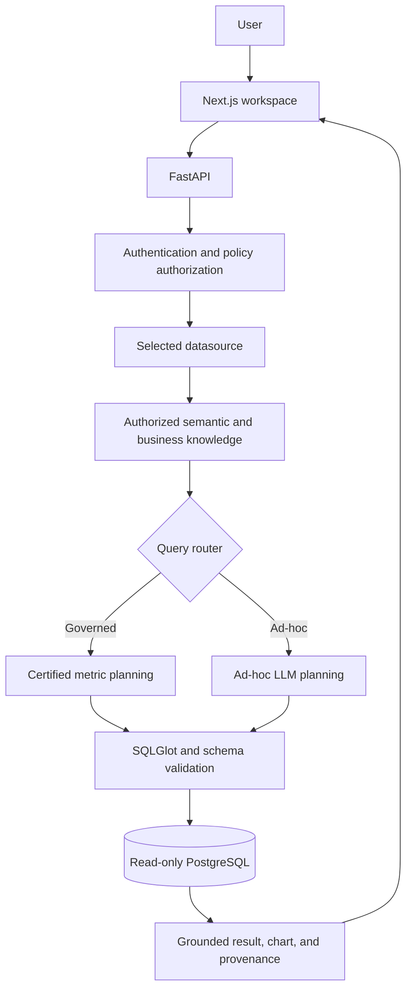

Every major component — model provider, database, semantic layer, authorization — is swappable without changing the core orchestration.

## How A Question Is Answered

Consider: **“How much are we committed to paying employees annually?”**

1. The user selects a datasource.
2. Authentication establishes identity; authorization filters the available tables, columns, and metrics.
3. Confirmed semantics translate business language into that datasource's concepts.
4. Relevant approved metrics, rules, examples, entities, and time meaning are retrieved.
5. The router selects a certified metric when one fits; otherwise it uses the ad-hoc path.
6. The planner creates a fresh query for the current request.
7. SQLGlot enforces read-only safety and validates the SQL against the authorized schema.
8. A physically read-only database identity executes the query.
9. The answer and chart are checked against the returned rows.
10. The response includes a table, freshness and quality signals, and **Why This Answer?** lineage.

No cached answer or remembered number replaces the live database result.

## Two Analytics Paths

### Governed analytics

Questions that map to certified business metrics follow the governed path. Current metrics include Active Headcount, Annual Base Payroll, Net Payroll, Invoice Amount, Project Cost, Project Margin, and Budget Utilization.

The metric definition owns the approved formula, dimensions, filters, null behavior, and time behavior — computed by Wren, the platform's governed metrics engine.

### Ad-hoc analytics

New analytical questions use confirmed semantics, relevant business rules, approved planning examples, entity resolution, and the configured language model. The model generates fresh SQL for the question; that SQL still has to pass the same authorization and validation boundaries.

**Ad-hoc means “generated for this question,” not “uncontrolled.”**

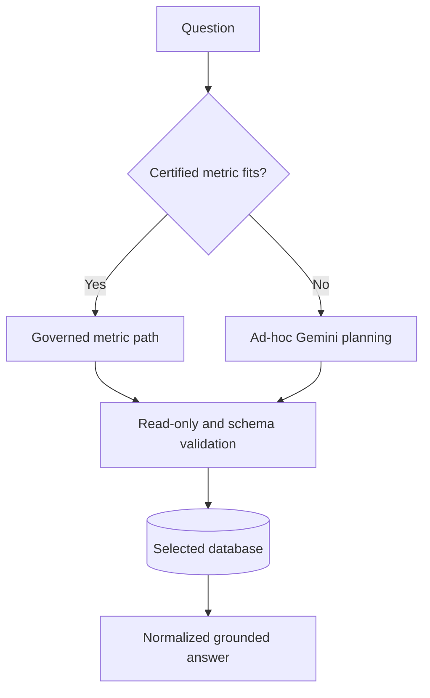

## Multiple Databases, Isolated Knowledge

Every request carries a `data_source_id`. The server resolves that ID to a registered connection; callers never submit a connection string.

Each datasource owns its own physical schema, semantic model, metrics, business rules, approved examples, recurring questions, candidates, time policy, quality checks, and evaluations.

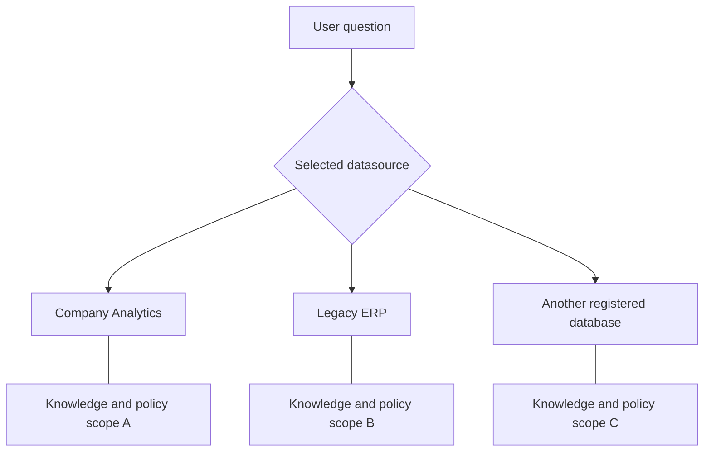

Knowledge from one datasource cannot silently affect another. A conversation thread is also bound to its datasource, so switching databases starts a separate analytical context. One question currently targets one datasource; cross-database joins are intentionally unsupported.

## Semantic Understanding

Enterprise schemas rarely speak the language their users do. A physical field such as `analytics.employees.arabic_name` can be confirmed as **Employee → Arabic Name**. In the Legacy ERP, `emp_mst` becomes **Employee** and `ann_sal_amt` becomes **Annual Salary**.

The scanner proposes meanings from physical metadata. A reviewer can approve, correct, or reject each proposal. Only confirmed meanings become runtime semantic knowledge.

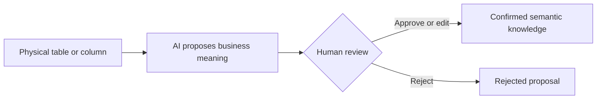

### Retrieval, not answer caching

Semantic and relevance retrieval answer: **“Which approved business knowledge matters for this question?”** They help select certified metric candidates and relevant semantic context, rules, examples, and recurring patterns without requiring exact internal names.

The database query answers a different question: **“What is the current value?”** Retrieval never substitutes stored text or an old result for live execution.

## Entity Resolution

Entity names are resolved against bounded values from the selected live database. If “Operations” refers to both `OU2100` and `OU2200`, the system asks the user to choose instead of inventing a canonical ID.

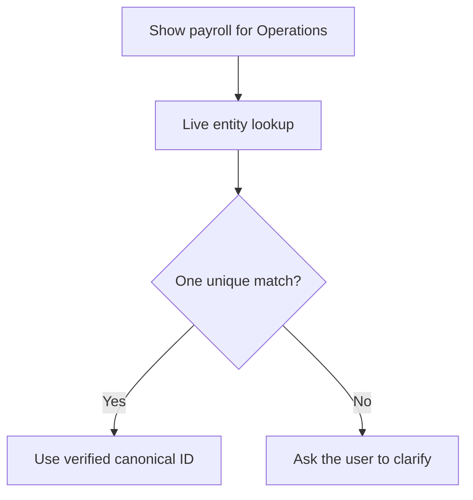

## The Knowledge Workspace

The `/knowledge` workspace makes the system's understanding reviewable rather than hidden in prompts.

| Area | Purpose |
| --- | --- |
| Data Sources | Manage registered databases without exposing credentials |
| Schema Review | Approve, correct, or reject proposed business meanings |
| Confirmed Semantics | Inspect trusted entities, attributes, and relationships |
| Recurring Questions | See analytical patterns users repeatedly ask |
| Candidates | Review proposed reusable knowledge |
| Certified Metrics | Inspect official business measures |
| Approved Examples | Inspect verified examples used as planning context |
| Business Rules | Inspect approved company-specific guidance |
| Evaluations | Track known-answer regression cases |
| Data Quality | Review freshness and data-health assertions |
| Time Intelligence | Define calendars and temporal dimensions |

Review authority is separate from ordinary analytics access. A person who may read data does not automatically gain permission to redefine what that data means.

## Human-Reviewed Learning

Question Memory records how people ask and the shape of successful analysis, not result rows or answer values. Similar successful requests form datasource-scoped recurring clusters. A learning worker may then propose reusable knowledge.

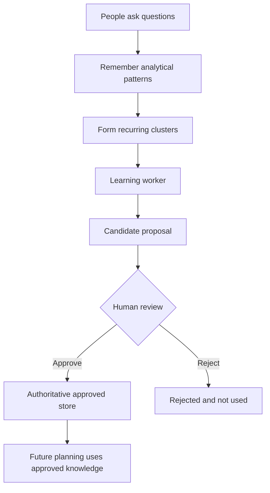

The worker can propose a metric, query example, business rule, filter, synonym, entity alias, join rule, or description improvement. **AI may propose; AI may not approve itself.**

### Candidates are not runtime truth

A candidate is review history. Approval promotes it into the normalized authoritative store used by future requests:

| Candidate type | Promoted destination |
| --- | --- |
| Metric | Certified Metrics |
| Query Example | Approved Examples |
| Business Rule | Business Rules |
| Filter, synonym, alias, join, description | Its corresponding approved semantic store |

Rejected candidates remain excluded from runtime knowledge. Approved query examples are particularly constrained: their SQL is **planning context only** and is never executed directly.

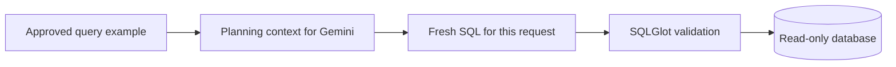

Business rules carry company-specific meaning, such as including posted project-cost transactions while excluding reversals. Retrieval supplies a rule only when it is relevant to the current question.

## Deterministic Time Intelligence

Phrases such as “fiscal year to date” cannot rely entirely on model intuition. Each datasource can define its timezone, week start, fiscal-year start, naming convention, and approved temporal dimensions.

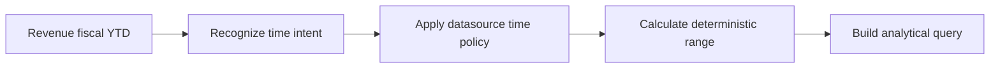

The model can understand the requested intent, but backend code computes the authoritative dates. Metric behavior also matters: flow metrics such as revenue and cost accumulate across a period, while snapshot metrics such as current headcount must not be summed across daily observations.

## Evaluations And Data Quality

Important questions can be saved with human-confirmed expectations. After changing a model, prompt, semantic mapping, rule, or metric, the evaluation centre reruns those questions and marks outcomes such as pass, fail, regression, or improvement.

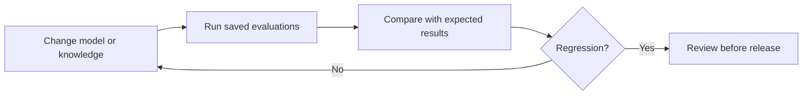

Correct SQL over stale or broken data can still mislead. Datasource quality checks cover freshness, row counts, null rates, uniqueness, accepted values, and bounded custom checks. Answers display only warnings relevant to the tables they actually used.

## Why This Answer?

Every answer can expose a deterministic explanation assembled from runtime state and validated SQL, not a story generated by the model. Depending on the route and the caller's permissions, it can show:

- selected datasource and governed or ad-hoc route
- certified metrics, business rules, and approved examples actually used
- resolved entities and time interpretation
- physical tables and columns
- SQL validation status and capability-gated debug SQL
- model profile, freshness, and relevant data-quality warnings
- grounding status and metric dependency lineage

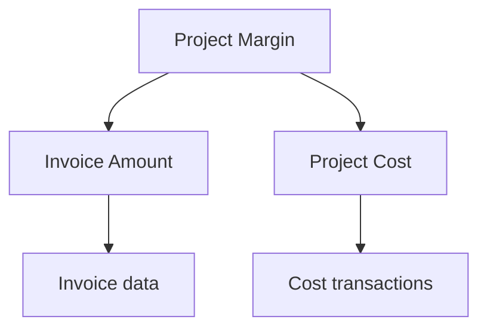

Numerical claims must cite fields in actual returned rows. Unsupported numbers, missing fields, invalid row references, and claims against empty results fail grounding rather than silently reaching the user.

## Safety Model

Security is layered. Prompts are useful instructions, not the security boundary.

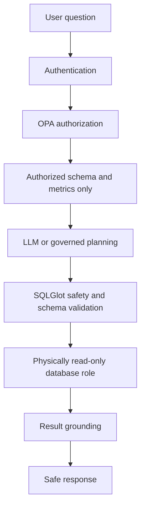

- The browser never receives database passwords or connection strings.
- OPA filters schemas, tables, columns, and governed metrics before model context or execution.
- SQL must be exactly one bounded read-only statement; mutations, system catalogs, projection stars, unsafe functions, and unknown schema references are rejected.
- Security failures are never “repaired” into a different query. Eligible schema mistakes get at most one repair attempt and full revalidation.
- PostgreSQL credentials are physically read-only, independently of application checks.
- Cloud use of database-derived context requires explicit `ALLOW_CLOUD_DATABASE_DATA=1`.
- Models and providers never silently fall back.
- Generated SQL is hidden by default and requires configuration plus policy-granted debug authority.
- Credentials, prompts containing sensitive data, and result rows are excluded from normal logs and public provenance.

Production authentication uses standards-based OIDC/JWT validation, including Microsoft Entra ID; local development uses a simplified identity so the rest of the stack can be exercised without an identity provider.

## Legacy ERP Stress Test

The repository includes a synthetic Legacy ERP designed to expose failures that clean demo schemas hide: abbreviated names, missing physical foreign keys, effective-dated compensation, coded statuses, text-formatted dates, duplicate display names, void invoices, reversals, and unposted costs.

Its tested canonical values include:

| Business fact | Verified value |
| --- | ---: |
| Active employees | 42 |
| Current annual payroll | 6,345,000 |
| Valid invoice revenue | 839,700 |
| Valid project costs | 1,042,500 |

This fixture demonstrates that semantics, rules, entity resolution, and validation are not hardcoded around one tidy analytics schema.

## Persistence And Conversation

Asking a follow-up continues the same analytical context — prior metrics, filters, time range, and recent turns — instead of starting over. That context, along with all approved knowledge (semantics, metrics, rules, examples, candidates, evaluations, quality checks, and time policies), is stored in PostgreSQL and survives restarts. It's separate from Question Memory, which learns from recurring patterns across requests rather than continuing a single conversation.

## Technology

| Area | Stack |
| --- | --- |
| Frontend | Next.js, React, TypeScript |
| Backend | Python, FastAPI, LangGraph |
| Database | PostgreSQL |
| AI | Vertex AI / Gemini |
| Analytics | Wren |
| Safety | SQLGlot, OPA, read-only database access |
| Testing | pytest, Vitest |

Optional adapters (Cube, MCP Toolbox, OpenMetadata, local-model providers) are documented in [`docs/backend-v1.md`](docs/backend-v1.md).

## Repository Map

```text
enterprise-data-agent/
├── app/              # FastAPI, LangGraph, gateways, safety, and knowledge services
├── frontend/         # Next.js analytics and Knowledge workspaces
├── infra/            # PostgreSQL fixtures, OPA policy, Compose, Wren, and Toolbox config
├── semantic/         # Governed Wren and Cube definitions
├── tests/            # Unit, integration, security, evaluation, and live opt-in tests
├── scripts/          # Startup and controlled operational helpers
├── docs/             # Architecture, decisions, evaluations, and operations
└── pyproject.toml    # Python package, tools, and command entry points
```

## Quick Start

### Requirements

- Python 3.12+
- Node.js and npm
- Docker Desktop with Compose for the integrated PostgreSQL, Wren, and OPA stack
- Provider credentials for live model use; Google Cloud CLI and ADC when using Vertex AI

### Install

```powershell
python -m venv .venv
.\.venv\Scripts\python.exe -m pip install -e ".[dev]"
Copy-Item .env.example .env

Set-Location frontend
npm ci
Set-Location ..
```

`.env` is ignored by Git. Keep credentials there only for local development; never commit it. The template defaults to fake database and LLM adapters, so deterministic development does not require cloud credentials or PostgreSQL.

### Run the service-free development backend

```powershell
.\.venv\Scripts\python.exe -m app.runtime
```

The API is available at `http://127.0.0.1:8000`, with OpenAPI at `/docs` and health checks at `/health/live` and `/health/ready`.

### Run the integrated local backend

Configure unique local PostgreSQL passwords and the selected model route in `.env`. For a Vertex AI route, authenticate ADC before startup:

```powershell
gcloud auth application-default login
.\scripts\start_backend.ps1
```

The script starts analytics PostgreSQL, the separate checkpoint/knowledge PostgreSQL, OPA, and Wren, waits for them to become healthy, and starts FastAPI. See [`docs/backend-v1.md`](docs/backend-v1.md) for the full configuration and [`docs/testing/legacy-erp.md`](docs/testing/legacy-erp.md) for the Legacy ERP fixture.

### Run the frontend

In a second terminal:

```powershell
Set-Location frontend
npm run dev
```

Open `http://localhost:3000`. The frontend proxies approved routes to FastAPI at `http://127.0.0.1:8000` by default.

## Testing

Backend checks:

```powershell
.\.venv\Scripts\python.exe -m pytest -q
.\.venv\Scripts\python.exe -m pytest --run-postgres -m postgres -q
.\.venv\Scripts\python.exe -m pytest --run-legacy -m legacy -q
.\.venv\Scripts\ruff.exe check .
.\.venv\Scripts\mypy.exe .
```

Frontend checks:

```powershell
Set-Location frontend
npm test
npx tsc --noEmit
npm run lint
npm run build
```

PostgreSQL, Legacy ERP, OPA, Wren, Cube, local-model, and cloud-model tests are explicit opt-ins. Normal `pytest` does not make paid cloud calls.

## Current Limitations

- One analytical request targets one datasource; cross-database joins are not supported.
- Reusable business knowledge requires human review before it becomes authoritative.
- Live model use requires configured Google credentials; database-derived cloud context also requires explicit permission.
- Production Entra tenant consent and interactive login are deployment-specific.
- OpenMetadata integration is optional and adapter-tested, but a complete local deployment is not part of this repository.
- Additional database engines beyond PostgreSQL need their own adapter.
- Local Compose is a development environment, not a production high-availability deployment.
- Full observability infrastructure and production deployment architecture remain outside the current scope.

## Further Reading

- [Backend V1 architecture](docs/backend-v1.md)
- [Legacy ERP test environment](docs/testing/legacy-erp.md)
- [Learning loop decision](docs/decisions/0014-analytics-learning-loop.md)
- [Wren governed metrics decision](docs/decisions/0011-wren-governed-metrics.md)
- [Schema-aware SQL validation](docs/decisions/0005-schema-aware-sql-validation.md)
- [Authentication and OPA boundary](docs/decisions/0006-authentication-and-opa-authorization.md)
- [Time intelligence](docs/decisions/0015-time-intelligence.md)
